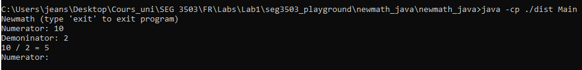
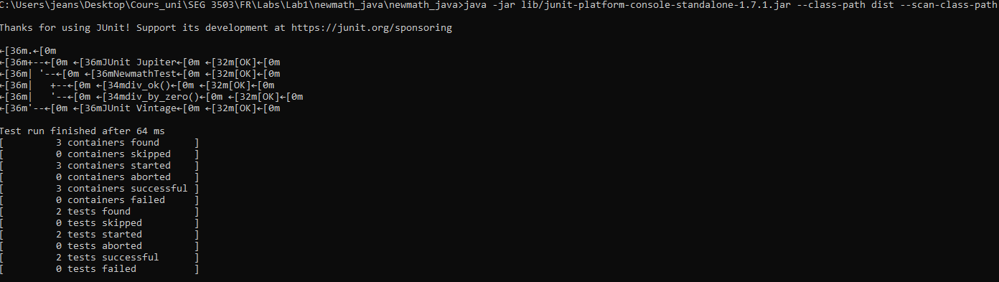
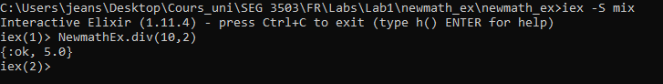
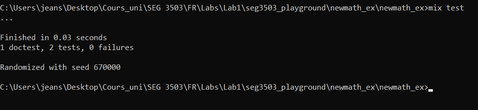

## Synopsis

| Syntax | Description |
| --- | --- |
| Cours | SEG 3503 |
| Travail | Lab 1 |
| Nom | Jean-Sébastien Demers |
| Numéro d'étudiant | 300115743 |
| Professeur | Andrew Forward, aforward@uottawa.ca |
| TA | Aymen Mhamdi, amham077@uottawa.ca |


Lien au repo: https://github.com/JSIT-20/seg3503_playground

Le code se retrouve dans les folders 'newmath_ex' et 'newmath_java'

Les captures d'écran du code exécuté sur mon ordinateur sont dans le folder 'assets'

Veuillez voir la section 'Instructions' ci-dessous pour voir comment exécuter le code sur un environnement Windows

## Instructions

### Java

J'utilise la version 16 de java.

Pour runner newmath_java, j'exécute les lignes suivantes dans mon command line

```
javac -encoding UTF-8 --source-path src -d dist src/*.java
javac -encoding UTF-8 --source-path test -d dist -cp dist;lib/junit-platform-console-standalone-1.7.1.jar test/*.java
```

Ensuite, la ligne suivantes pour runner l'application

```
java -cp ./dist Main
```



### JUnit

Pour les tests JUnit, je run la ligne suivante

```
java -jar lib/junit-platform-console-standalone-1.7.1.jar --class-path dist --scan-class-path
```



### Elixir

J'utilise la version 1.11.4 de Elixir avec la version 21 de Erlang

Pour runner le programme en Elixir, je tappe les lignes suivantes dans la console (avec l'exemple de 10 divisé par 2)

```
iex -S mix
NewmathEx.div(10,2)
```



### ExUnit

Pour runner les tests d'Elixir, je run la commande suivante

```
mix test
```



