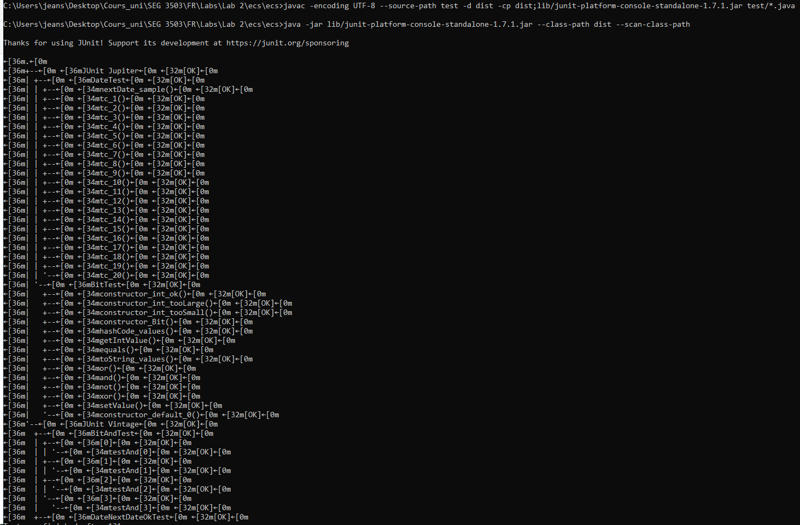
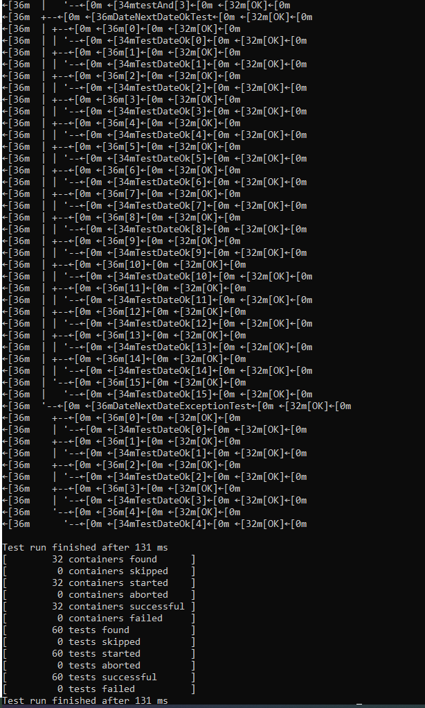

## Synopsis

| Syntax | Description |
| --- | --- |
| Cours | SEG 3503 |
| Travail | Lab 2 |
| Nom | Jean-Sébastien Demers |
| Numéro d'étudiant | 300115743 |
| Professeur | Andrew Forward, aforward@uottawa.ca |
| TA | Aymen Mhamdi, amham077@uottawa.ca |

Lien au repo: https://github.com/JSIT-20/seg3503_playground

## Description du lab

Le lab 2 est composé de deux exercises.

Pour le premier exercice, svp voir le tableau ci bas en dessous de 'Exercice 1'. Pour voir des screenshots des résultats de tests, svp voir le folder assets qui contient les images.

Pour l'exercice 2, j'ai ajouté mon code dans les fichiers DateTest.java, DateNextDateExceptionTest.java et DateNextDateOkTest.java. Tous ces fichiers se trouvent sous ecs/ecs/test. Vous verrez ci-bas un screenshot des tests exécutés sur mon ordinateur Windows au travers de la command line.

## Exercice 1

| Cas de test | Résultats escomptés | Résultats actuels | Verdict |
| --- | --- | --- | --- |
| 1 | Demande d'inscription acceptée | Demande d'inscription acceptée | Succès |
| 2 | Demande d'inscription acceptée | Demande d'inscription acceptée | Succès |
| 3 | Demande d'inscription acceptée | Demande d'inscription acceptée | Succès |
| 4 | Demande d'inscription acceptée | Demande d'inscription acceptée | Succès |
| 5 | Err 1 | Err 1 | Succès |
| 6 | Err 1 | Err 1 | Succès |
| 7 | Err 1 | Err 1 | Succès |
| 8 | Err 1 | Err 1 | Succès |