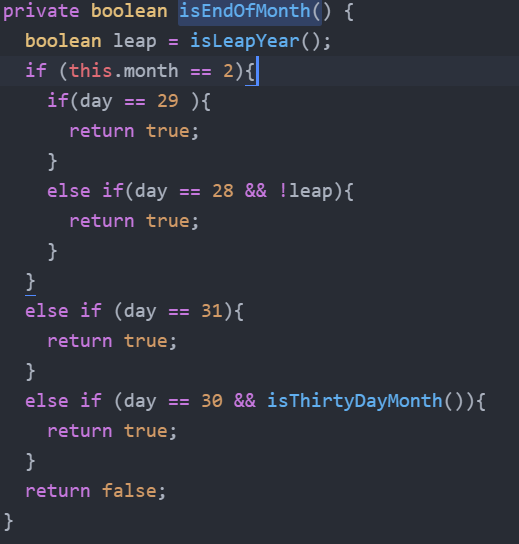

## Synopsis

| Syntax | Description |
| --- | --- |
| Cours | SEG 3503 |
| Travail | Lab 3 |
| Nom | Jean-Sébastien Demers |
| Numéro d'étudiant | 300115743 |
| Professeur | Andrew Forward, aforward@uottawa.ca |
| TA | Aymen Mhamdi, amham077@uottawa.ca |

Lien au repo: https://github.com/JSIT-20/seg3503_playground/lab03

## Description du lab

Le lab 3 est composé de deux parties.

La première partie consiste de créer des tests cases additionnels pour la classe Date.java afin d'atteindre une meilleure couverture du code. Vous trouverez mes observations à ce sujet sous la section 'Date.java couverture de code avec Jacoco' ci-bas. Les test cases que j'ai ajouté se trouvent dans les fichiers DateNextDateExceptionTest.java, DateNextDateOkTest.java et DateTest.java. Tous ces fichiers se retrouvent sous /date/date/test. Il y a également des screenshots de la couverture finale et initiale de Date.java sous /assets.

Pour la partie 2 du lab, veuillez voir la section 'Refactoriser Date.java'. Pour la refactorisation, j'ai refactorisé deux fonctions dans le fichier Date.java trouvé sous /date/date/src.

## Date.java couverture de code avec Jacoco

Je ne crois pas qu'il est possible d'avoir une couverture de code de 100%. 
Certaines méthodes comme isEndOfMonth() contiennent des combinaisons d'arguments impossibles à atteindre.
Par exemple, le jours de la date ne peut pas être 31 et 30 en même temps, donc les combinaisons ou le jours est 31 et le jours est 30 sont impossibles à couvrir.

Initiallement, il y avait une couverture d'énoncés de 85% et une couverture de branches de 79%

En ajoutant 18 tests, j'ai réussi à monter la couverture d'énoncés à 99% et la couverture de branches à 92%.

## Refactoriser Date.java

Pour refactoriser Data.java, j'ai fait deux modifications.

Il y avait deux méthodes qui causaient des branches impossibles à atteindre: isEndOfMonth() et isThirtyDayMonth().

Pour isEndOfMonth, il était impossible que le jours soit égal à 30 et 31 en même temps.

Pour isThirtyDayMonth, même principe, le mois peux seulement avoir une valeur.

J'ai donc séparé les clauses en plusieurs blocs conditionnels.

Ces modifications m'ont permis de monter ma couverture d'instructions à 100% et ma couverture de branches à 97%.

La couverture a monté puisque des branches qui ne pouvaient pas être couvertes auparavant sont maintenant couvertes.

