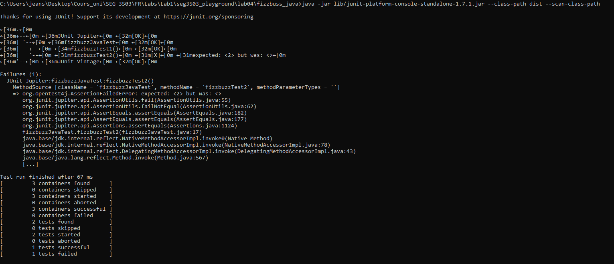
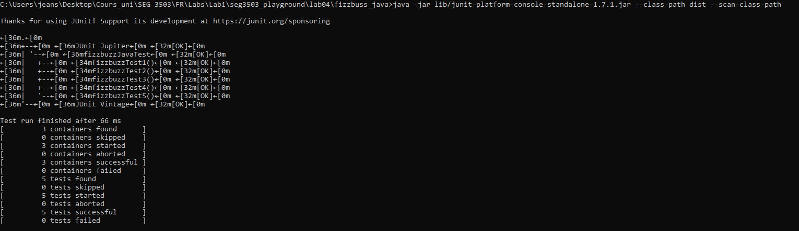

## Synopsis

| Syntax | Description |
| --- | --- |
| Cours | SEG 3503 |
| Travail | Lab 4 |
| Nom | Jean-Sébastien Demers |
| Numéro d'étudiant | 300115743 |
| Professeur | Andrew Forward, aforward@uottawa.ca |
| TA | Aymen Mhamdi, amham077@uottawa.ca |

Lien au repo: https://github.com/JSIT-20/seg3503_playground/tree/main/lab04

## Description du lab

Le but du lab 4 est de faire du Test Driven Development. Pour ce lab, j'ai choisi de faire l'option fizzbuzz (en java).

Mes commits sont regroupés en 6 groupes. Dans chaque groupe, il y a les éléments suivants:

- L'ajout d'un test
- La preuve que le test ne fonctionne pas
- Modification du code pour faire fonctionner le test
- Preuve que les tests fonctionne après la modification
- Refactorisation du code
- Preuve que les tests fonctionnent après la modification

Des images sont fournies pour chaque groupe de commit. Le code est disponible dans le folder /fizzbuzz_java. Les instructions pour compiler et exécuter le code sur un ordinateur windows sont dans le folder /fizzbuzz_java/bin.

## Commit Group 1

Ajout d'un test

Preuve que test ne fonctionne pas

Modification du code

Preuve que les tests fonctionnent après la modification

Refactorisation

Preuve que les tests fonctionnent après la modification

## Commit Group 2

Ajout d'un test

Preuve que test ne fonctionne pas

Modification du code

Preuve que les tests fonctionnent après la modification

Refactorisation

Preuve que les tests fonctionnent après la modification

## Commit Group 3

Ajout d'un test

Preuve que test ne fonctionne pas

Modification du code

Preuve que les tests fonctionnent après la modification

Refactorisation

Preuve que les tests fonctionnent après la modification

## Commit Group 4

Ajout d'un test

Preuve que test ne fonctionne pas

Modification du code

Preuve que les tests fonctionnent après la modification

Refactorisation

Preuve que les tests fonctionnent après la modification

## Commit Group 5

Ajout d'un test

Preuve que test ne fonctionne pas

Modification du code

Preuve que les tests fonctionnent après la modification

Refactorisation

Preuve que les tests fonctionnent après la modification

## Commit Group 6

Ajout d'un test

Preuve que test ne fonctionne pas

Modification du code

Preuve que les tests fonctionnent après la modification

Refactorisation

Preuve que les tests fonctionnent après la modification

