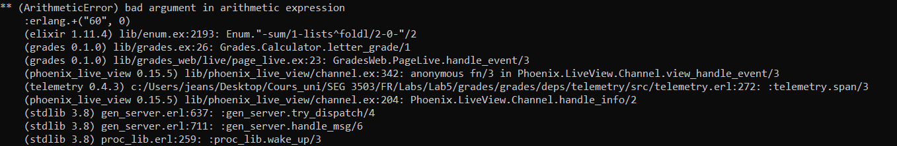
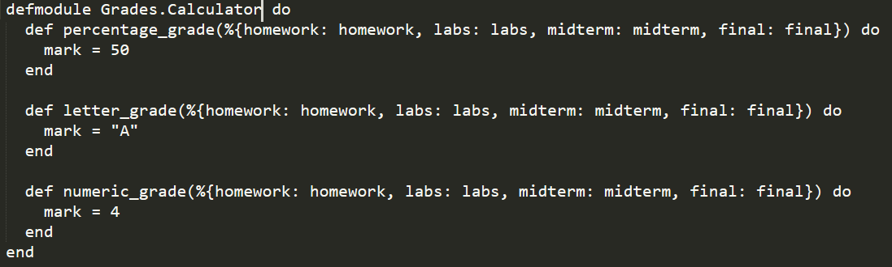
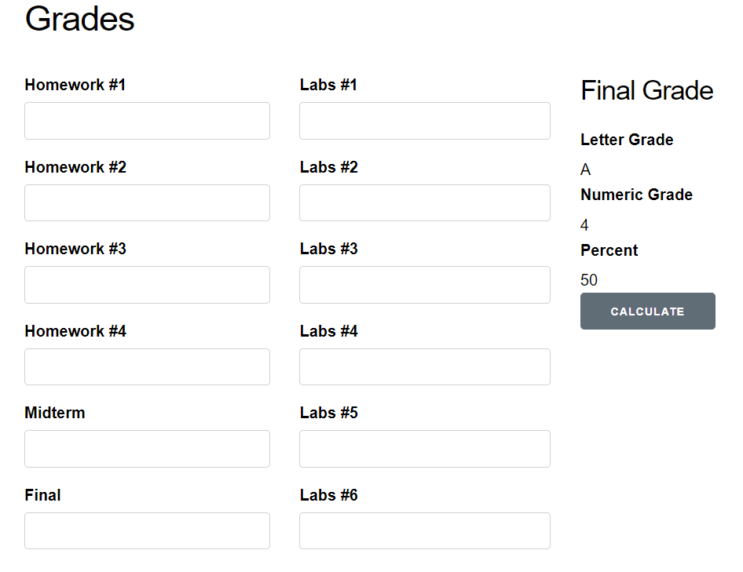
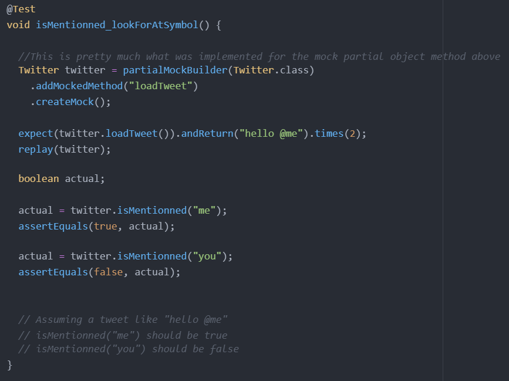
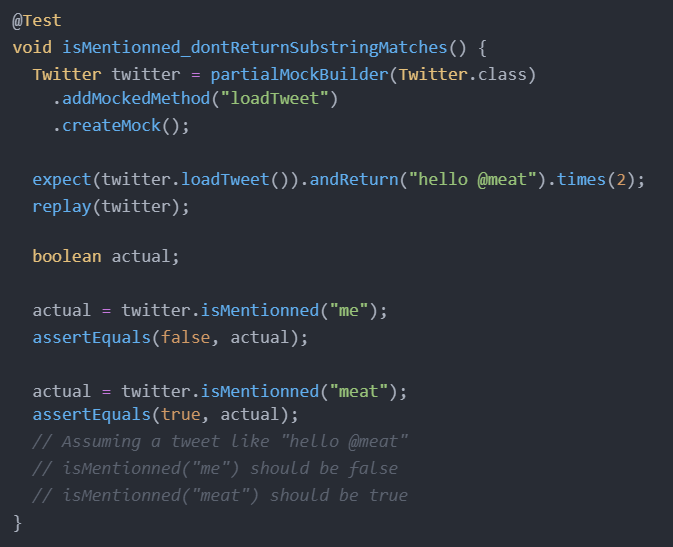
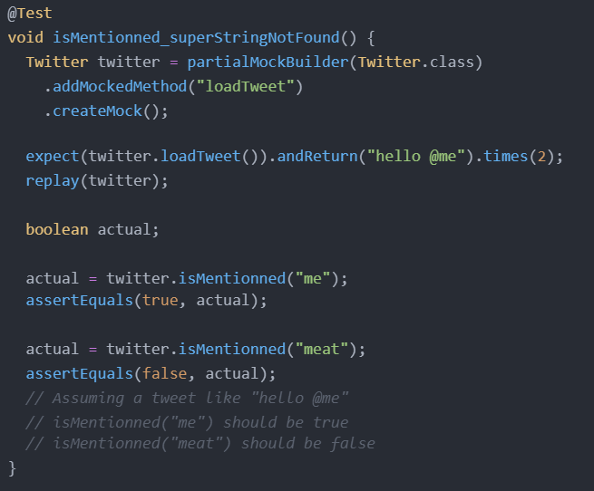
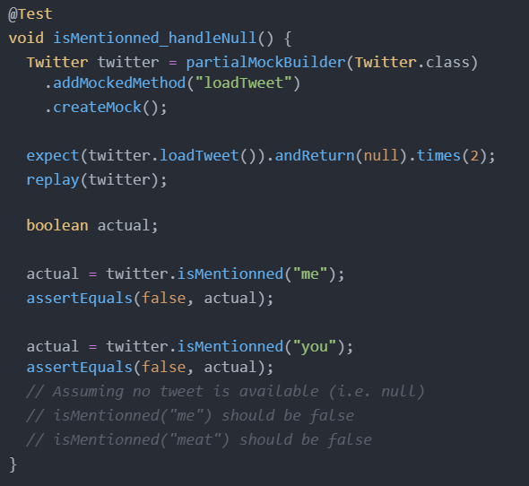
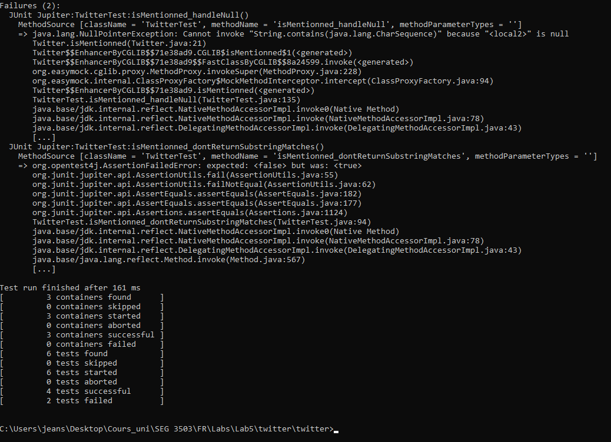
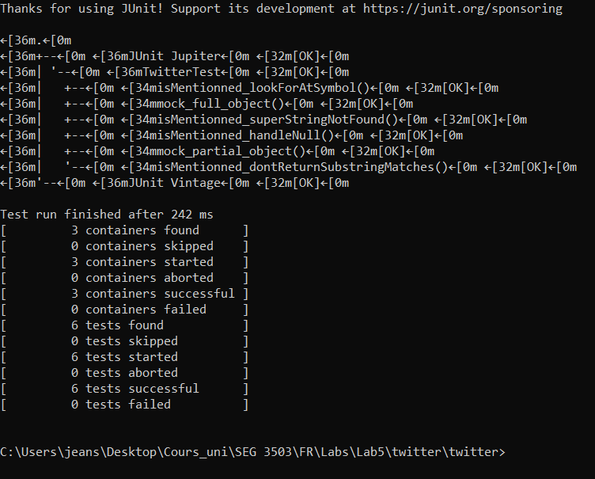

## Synopsis

| Syntax | Description |
| --- | --- |
| Cours | SEG 3503 |
| Travail | Lab 5 |
| Nom | Jean-Sébastien Demers |
| Numéro d'étudiant | 300115743 |
| Professeur | Andrew Forward, aforward@uottawa.ca |
| TA | Aymen Mhamdi, amham077@uottawa.ca |

Lien au repo: https://github.com/JSIT-20/seg3503_playground/tree/main/lab05

## Description du lab

Le but du lab 5 est de se familiariser avec les stubs et mocks.

Le lab fait l'utilisation d'un projet 'grades' et d'un autre projet relié à twitter.

## Partie 1 - Grades

En utilisant le code créé pour le devoir 2, l'erreur suivante est générée en cliquant sur le bouton calculate.

Cette erreur semble être due au fait que les variables données à la fonction letter_grade sont en String, mais la fonction utilise des int. Alors, quand la fonction fait des opérations arithmétiques, une erreur va être lancée.

Pour régler cette erreur, il faudrait convertir les données en int.

Pour le stub, j'ai simplement fait que les fonctions retournent un chiffre statique.

Le résultat attendu est trouvé. Quand je clique le bouton calculate, je recois l'output suivant:

Au besoin, vous pouvez trouver le fichier utilisant ma solution du devoir 2 sous grades/grades/lib/grades.ex

Vous trouverez aussi la version avec le stub sous grades/grades/lib/grades/calculator_stub.ex

## Partie 2 - Twitter

Pour la partie sur twitter, il fallait compléter quatre mock tests.

Voici mes tests implémentés. Vous pouvez aussi voir le code sous twitter/twitter/test/TwitterTest.java

Deux des tests n'ont pas passé. Celui qui analyse les substrings et celui qui analyse les cas ou il n'y a pas de tweets (null).

J'ai donc modifié le code de la méthode isMentionned pour que les tests passent. Voici mes modifications:

Tous les tests sont maintenant fonctionnels

Au besoin, vous pouvez trouver le code de mes tests sous twitter/twitter/test/TwitterTest.java

Vous pouvez aussi trouver le code twitter modifié sous twitter/twitter/src/Twitter.java

