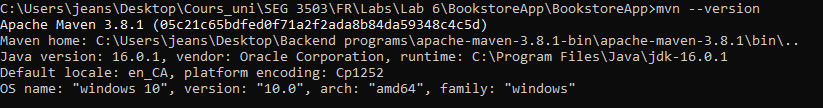
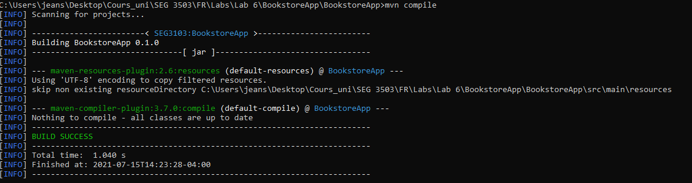
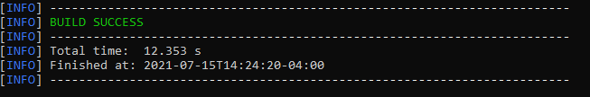
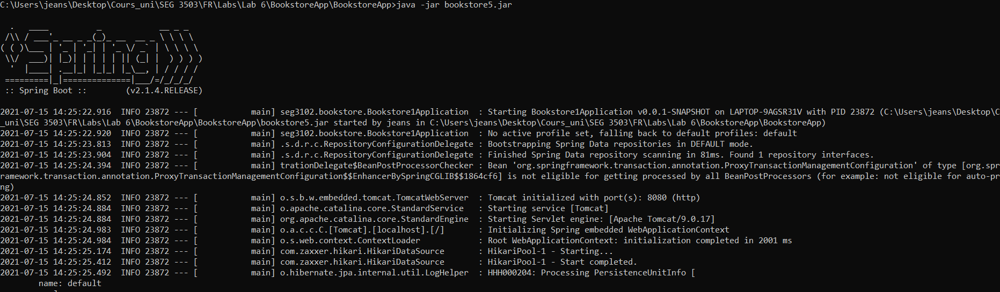
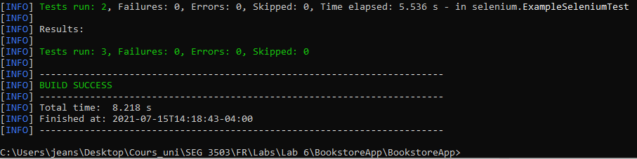
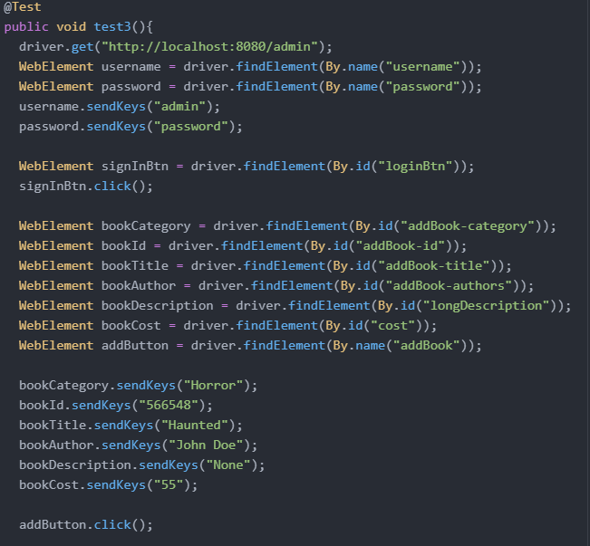
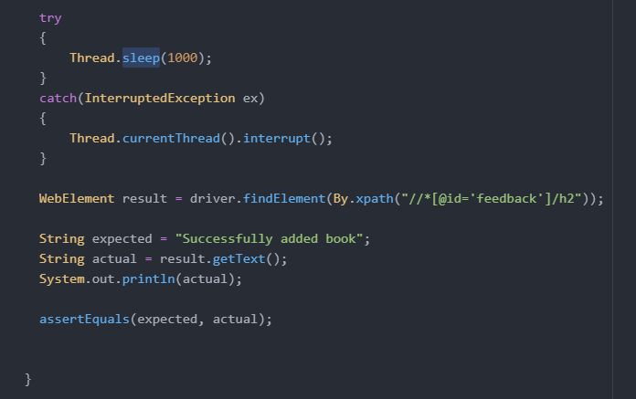
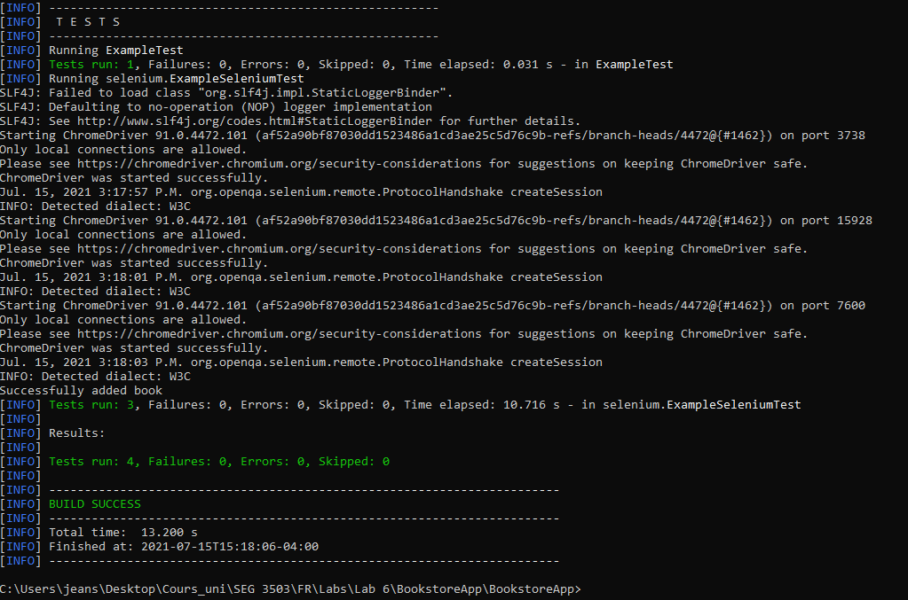

## Synopsis

| Syntax | Description |
| --- | --- |
| Cours | SEG 3503 |
| Travail | Lab 6 |
| Nom | Jean-Sébastien Demers |
| Numéro d'étudiant | 300115743 |
| Professeur | Andrew Forward, aforward@uottawa.ca |
| TA | Aymen Mhamdi, amham077@uottawa.ca |

Lien au repo: https://github.com/JSIT-20/seg3503_playground/tree/main/lab06

## Description du lab

Le but du lab 5 est de se familiariser avec les maven et selenium (selenium peut être utilisé pour automatiser des tests d'acceptation des utilisateurs).

Vous pouvez retrouver le test Selenium que j'ai fait sous ./BookstoreApp/src/test/java/selenium/ExampleSeleniumTest.java

Le test se nomme test3

## Maven

Comme demandé, voici l'output de quelques commandes de maven

mvn --version:

mvn compile:

mvn package -DskipTests:

Je crois que cette commande va compiler et packager le code. La commande -DskipTests fait qu'on compile les tests mais on ne les exécute pas.

java -jar bookstore5.jar

mvn test

## Selenium

Voici le test additionnel que j'ai fait:

Le but de ce test est de vérifier si le message 'Successfully added book' est bien montré quand un administrateur ajoute un livre et qu'il n'y a pas de conflits.

Le test fonctionne comme supposé

