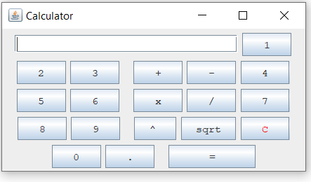
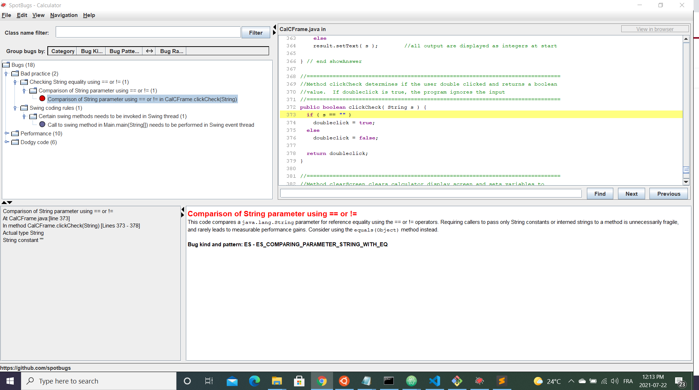
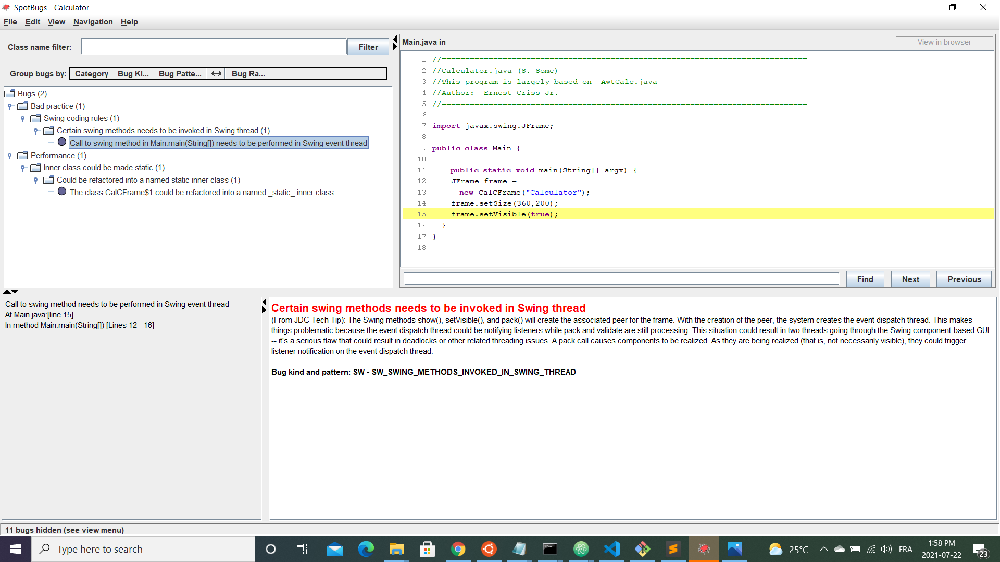
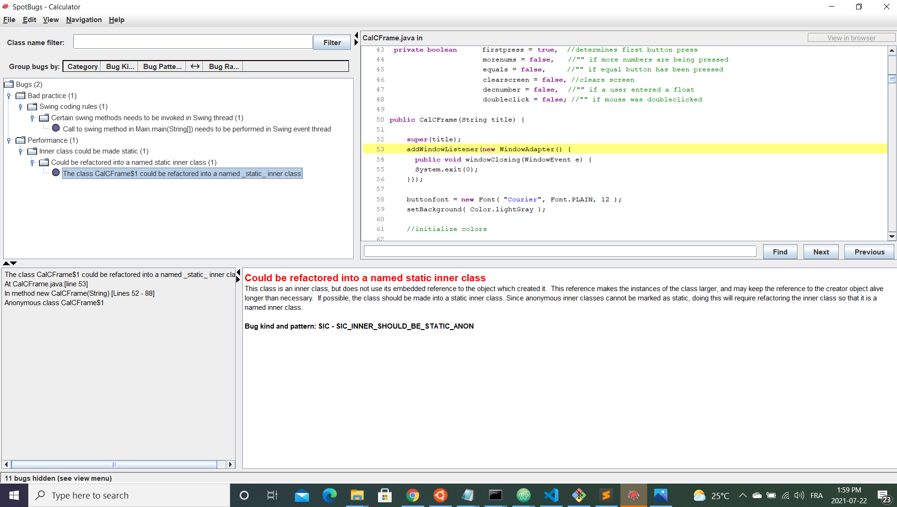

## Synopsis

| Syntax | Description |
| --- | --- |
| Cours | SEG 3503 |
| Travail | Lab 7 |
| Nom | Jean-Sébastien Demers |
| Numéro d'étudiant | 300115743 |
| Professeur | Andrew Forward, aforward@uottawa.ca |
| TA | Aymen Mhamdi, amham077@uottawa.ca |

Lien au repo: https://github.com/JSIT-20/seg3503_playground/tree/main/lab07

## Description du lab

Le but du lab 7 est d'utiliser l'outil SpotBugs, qui aide à trouver des bugs dans notre programme. Ensuite, il faut corriger ou expliquer les bugs trouvés.

Vous pourrez voir les bugs que j'ai corrigé en regardant l'historique des commits (des messages descriptifs sont attachés à chaque commit).

## Instructions

Pour compiler le code:

javac -encoding UTF-8 --source-path src -d dist src/*.java

javac -encoding UTF-8 --source-path test -d dist -cp dist;lib/junit-platform-console-standalone-1.7.1.jar test/*.java

Voici une image de l'application:

Pour exécuter SpotBugs:

java -jar ./lib/spotbugs/lib/spotbugs.jar

## Résultats

Initialement, il y avait 18 bugs dans l'application et dans le fichier de test.

Après avoir fixé certains bugs (voir les commits pour plus d'information), je suis passé à 2 bugs restants.

Le premier bug est lié à JFrame. Le message d'erreur dit 'Certain swing methods needs to be invoked in Swing thread'. Je n'ai pas d'expérience avec JFrame, donc il est difficile pour moi de régler ce bug.

Le deuxième bug est aussi lié à JFrame. Le message d'erreur est 'Could be refactored into a named static inner class'.

